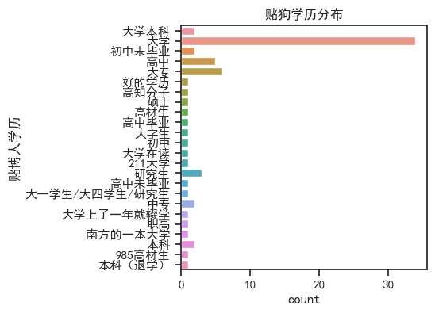

## 赌狗、撸贷狗行为特征数据库
近年，沉迷网贷和网赌者大量增长，其中许多受害人表现出了类似于药物成瘾的精神状态，对借贷/赌徒本人和家庭造成巨大的伤害，危害社会稳定，然而针对网贷和网赌成瘾者的网络行为模式的研究却存在着明显的不足。相关的案例统计数量也十分匮乏。
"戒社"是中国一个专注于揭露和劝诫赌博、网贷成瘾等问题的内容创作者，以真实案例分析和直击人性的劝诫风格受到关注，其内容发布平台包括微博和bilibili，自2019年起，戒社便收到了大量沉迷网贷和赌博者的投稿，以及发布了大量对投稿内容的解析和批判，至今已公开了数千个网贷和网赌成瘾者的案例和投稿。
由于这些网贷和网赌成瘾者的案例缺乏系统的整合和统计，本项目旨在利用AI解读的方式，了解网贷和网赌成瘾者的行为模式以及特征，本项目作者（Gao JoJo）亲自声明，所有戒社投稿的内容均由AI解读，为100%纯正正宗口味的AI创作，不参杂一丁点人类的偏见和修改。

## 工作流程
### 数据获取：
原始数据为戒社2019年-2024年底微博公开的赌狗、撸贷狗的投稿图片（小作文和聊天记录），爬取微博目标账号为 “我是戒戒”(7341380661)和“戒社”(6275012702)；
戒社微博图片通过爬虫批量获取，脚本采用了weibo-crawler-master （https://github.com/dataabc/weibo-crawler）；
文件夹“JieShe”中提供了数张典型的戒社投稿图片。

### AI分析投稿图片：
利用GPT模型KIMI的Json mode，对每个投稿提取以下特征：
- 投稿时间（年月日时）
- 投稿人与赌博人的关系
- 赌博人性别
- 年龄
- 职业
- 社会地位
- 身体健康程度
- 家庭成员及职业
- 是否单亲/离异家庭
- 赌博人的负债
- 赌博被发现次数
- 赌博人学历
- 初赌年龄
- 初赌是否成年？
- 赌龄
- 最初赌博游戏（网赌？线下赌博？）
- 初赌的输赢情况
- 是否提到世界杯/电竞？
- 赌博人债务来源（网贷家庭朋友同事）
- 赌博被发现或主动坦白的次数
- 赢钱后的消费方式
- 赌博人家庭初次发现赌博人赌博后的处理方式是什么
- 赌博人是否表现出自杀倾向
- 赌博人结局

参见脚本step1.figure prase based on KIMI.py

### 分析：
瞎几把分析,参见脚本step2.data cleaning and plot.py
e.g.

## Online gamble or loan Junkie behavior characteristics database
In recent years, there has been a large increase in the number of people addicted to online lending and gambling, and many of the victims show a mental state similar to drug addiction, causing great harm to the borrowers/gamblers themselves and their families, and endangering social stability. However, there are obvious deficiencies in the research on the online behavior patterns of online lending and gambling addicts. Case statistics are also scarce.
"Jieshe" is a content creator in China who focuses on exposing and admoniting gambling and online lending addiction. It has attracted attention with its real case analysis and direct admonitions to human nature. Its content publishing platforms include Weibo and bilibili. As well as the release of a large number of contributions to the analysis and criticism of the content, so far has been made public thousands of online loan and online gambling addiction cases and contributions.
Due to the lack of systematic integration and statistics of these cases of online loan and online gambling addicts, this project aims to understand the behavioral patterns and characteristics of online loan and online gambling addicts by means of AI interpretation. The author of this project (Gao JoJo) personally stated that all the content submitted by the association was interpreted by AI and created by AI with 100% pure taste. Without the slightest human bias or modification.

## Workflow
### Data acquisition:
The original data are the submission pictures (short essays and chat records) of dog gambling and dog lending published by Jiejie Club on Weibo from 2019 to the end of 2024. The target accounts of Jiejie Club were "I am Jiejie" (7341380661) and "Jiejie Club" (6275012702).
Quit club weibo through crawler bulk access to images, script used weibo - crawler - master (https://github.com/dataabc/weibo-crawler);
The folder "JieShe" provides several pictures of typical Buddhist society submissions.

### AI analysis Submission picture:
Using the Json mode of GPT model KIMI, the following features are extracted for each contribution:
- Submission time (year/month/day)
- Relationship between the contributor and the gambler
- Sex of the gambler
- Age.
- Occupation.
- Social status.
- Physical health
- Family members and occupation
- Single parent/divorced family
- The gambler's liabilities
- Number of gambling discoveries
- Gambler's degree
- First bet age
- Is the first bet adult?
- Gambling years.
- Original gambling games (online gambling? Offline gambling?)
- Winning and losing the first bet
- Did you mention the World Cup/esports?
- Gambler debt source (online loan family friends colleagues)
- The number of times gambling was caught or confessed
- How you spend money after you win
- What did the gambler's family do when they first found out about the gambler's gambling
- Whether the gambler has shown suicidal tendencies
- Gambling man ending

See script step1.figure prase based on KIMI.py

### Analysis:
For some analysis, see the script step2.data cleaning and plot.py
